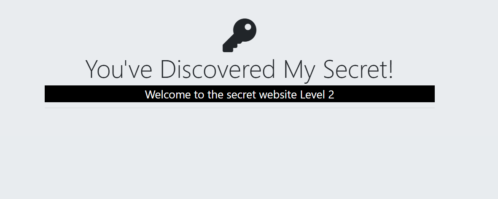
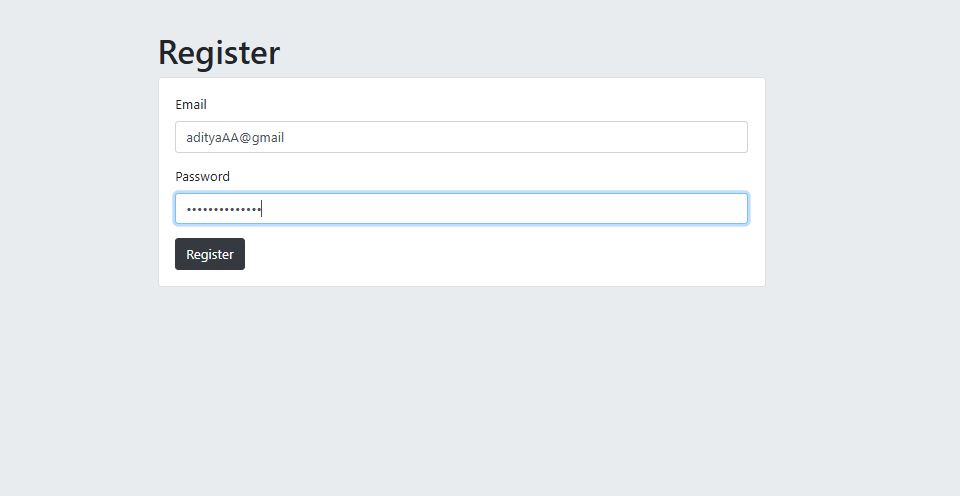
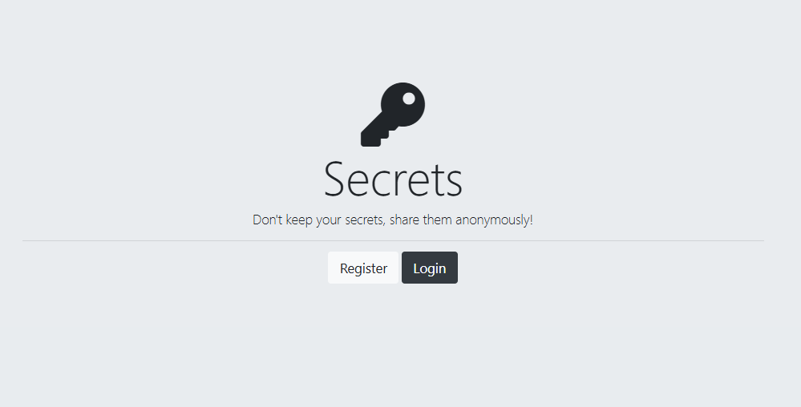
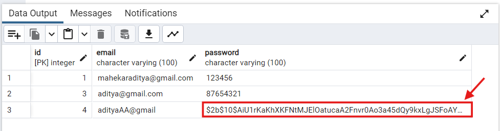

# 🔐 Login & Register Page – Level 3 Authentication


This project is a Login & Register Authentication System built with Node.js, Express, EJS, and PostgreSQL.
It demonstrates Level 2 Authentication, where user passwords are salted and hashed using bcrypt.js (Blowfish cipher) before storing them in the database.

Users can register with an email and password, log in securely, and gain access to a protected secrets page.
The project follows a modular EJS structure using partials (header.ejs, footer.ejs) and serves static assets through the public folder.

This is an educational project that shows how to implement scoure authentication and oraganize a full-stack Node.js app.

---
## Levels of Encryption:
<br>
Level 1: Cipher [Caesor Cipher,Hill Cipher, Playfair Cipher,...]<br>
Level 2: Hashing<br>
Level 3: Salting Rounds + Hashing<br>

---
📂 Project Structure:<br>
9.2+Authentication+Lv.2<br>
│── css/<br>
│   └── styles.css           Extra CSS file<br>
│<br>
│── public/<br>
│   └── styles.css           Public-facing CSS file<br>
│<br>
│── partials/<br>
│   ├── footer.ejs           Footer partial template<br>
│   └── header.ejs           Header partial template<br>
│<br>
│── views/<br>
│   ├── home.ejs             Home page<br>
│   ├── login.ejs            Login page<br>
│   ├── register.ejs         Register page<br>
│   ├── secrets.ejs          Protected page<br>
│   └── partials/            Shared partials<br>
│<br>
│── index.js                 Main server file<br>
│── package.json             Dependencies & scripts<br>
│── package-lock.json        Locked dependency versions<br>

---

## 📷 Gallery

| SignUp Page | Login Page |
|-------------|------------|
|  |  |

| Register Page | Secret Page |
|---------------|-------------|
|  |  |

| Database |
|----------|
|  |


---

## ⚙️ Setup Instructions

 1️⃣ Create Table in PostgreSQL(users):
 <br><br>
as given in the query.sql
 <br>
 
2️⃣ Install Dependencies:
```bash
npm i
npm i pg express ejs body-parser
```

3️⃣ Database Connection (index.js)
```bash
const app = express()
const db = new pg.Client({
  user: "postgres",
  host: "localhost",
  database: "XXXXX",    // <-- your database name
  password: "XXXXX",    // <-- your password
  port: XXXX,           // <-- your port name, by default for pg 5432
});
```
4️⃣ Run Server:
```bash
node index.js
```
---
👉 [Open App on Localhost](http://localhost:3000)
